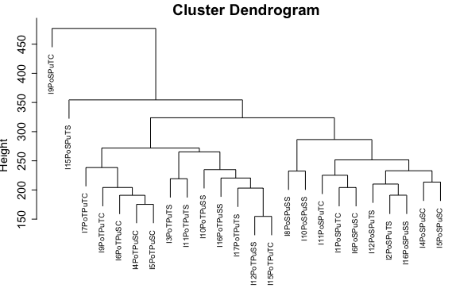

## RNA-seq de muestras de raíz en *Pinus pinaster*

### 1. Cómo acceder a las raw reads de RNA-seq y descripción de sus nombres

Las raw reads de raíz y tallo están aquí: /home/irene/PinasterRaizRNAseqReads

Yo solo voy a utilizar las de raíz.

```
Lib-Truseq-RNA-173367_18-7-RCO_P_151471_S16_R1_001.fastq
```
**Descripción del nombre**
1. Hasta el guión bajo _ no proporciona información de la muestra

2. Tras el guión bajo nos podemos encontrar o un 1 o un 18 (como en este ejemplo) que habla del portainjertos. El portainjertos contiene la raíz y un trozo grande de tallo. 

- 1: Portainjertos sensible 
- 18: Portainjertos tolerante

3. Después hay un guión -. Lo que viene después del guión es el número del individuo (en este caso es el individuo 7)

4. Luego viene un código de 3 letras (en este caso RCO)

- R: Raíz (o A: acícula)
- C: Habla del tratamiento que puede ser Control (o S sequía)
- O: Habla de la púa, que puede ser Oria, que es tolerante a la sequía (o G Galicia, sensible a la sequía). La púa se colocó muy arriba, luego la púa tiene acículas y un poco de tallo

Las púas son réplicas clonales de los parentales (uno de Galicia, y por lo tanto, se espera sensible a la sequía, y otro de Oria, y por lo tanto, se espera tolerante a la sequía), mientras que los portas son los descendientes de la F1 resultante del cruzamiento de los parentales Galicia x Oria. Se hizo un estudio fenotípico de la F1 y se determinó quienes eran sensibles y tolerantes a la sequía. De ellos se eligieron los individuos 1 (sensible) y 18 (tolerante) para usar como portainjertos (en este artículo se explica por qué (De Miguel et al. 2016). 

### 2. Análisis de las raw reads de RNA-seq

Algunos programas son más adecuados que otros para analizar datos de RNA-seq en función de si se tiene un transcriptoma o genoma de referencia, de si el genoma/transcriptoma está completamente anotado etc... Sin embargo, dentro de cada categoría, en muchos casos hay varios programas que hacen esencialmente lo mismo (por ejemplo, Salmon y Kallisto son pseudoaligners para mapear reads contra transcriptomas de referencia parcialmente anotados). Los siguientes artículos son de utilidad para tener una visión más clara sobre cómo tomar decisiones a la hora de analizar datos de RNA-seq (tener en cuenta que esto ha sido escrito en 2022-2023, así que con el tiempo estos artículos pueden quedar desactualizados):

- [**Systematic comparison and assessment of RNA-seq procedures for gene expression quantitative analysis**, Corchete et al. 2020](https://doi.org/10.1038/s41598-020-76881-x)
- [**Approaches to variant discovery for conifer transcriptome sequencing**, Telfer et al. 2018](https://doi.org/10.1371/journal.pone.0205835)
- [**Applications of transcriptome in conifer species**, Wei et al. 2022](https://doi.org/10.1007/s11240-022-02322-4)
- [**A survey of best practices for RNA-seq data analysis**, Conesa et al. 2016](https://doi.org/10.1186/s13059-016-0881-8)

**2.1. Control de calidad con FASTQC/MULTIQC**

Primero, en esa misma carpeta, utilicé el siguiente código para realizar el análisis de FASTQC (utilizo la versión 0.11.7)

```
module load fastqc/0.11.7
fastqc Lib*
```

También se puede utilizar el "path" donde se encuentren las secuencias y correr fastqc en otra carpeta. FASTQ reconoce automáticamente los archivos que contienen las raw reads de la carpeta a la que le dirijas (formato fastq.gz).

```
fastqc /home/FCAM/icobosimon/PineTestRaw/Lib*
```

Como son 24 muestras de raíz, obtienes dos resultados por muestra: un archivo acabado en *.html* y otro en *.zip*

Ahora utilizo [MULTIQC](https://multiqc.info/docs/) v1.12 para obtener un resumen de los resultados de FASTQC de las 24 muestras. MULTIQC te ofrece un report en formato *html* que contiene todos los resultados de FASTQC de todas las muestras en conjunto. Para ello, en la misma carpeta donde están los resultados de FASTC, corres el siguiente comando:

```
multiqc .
```

MULTIQC ya reconoce los archivos que necesita (los acabados en *.zip*). También puedes correr lo siguiente si no te fías

```
multiqc *_fastqc.zip
```

Obtienes como resultado el siguiente report: [multiqc_report](multiqc_report.html). Aquí hay un vídeo de youtube donde te explican cómo interpretar los resultados de MULTIQC: https://www.youtube.com/watch?v=qPbIlO_KWN0

**2.2. Trimming por calidad y longitud**

Aunque en tallo y acícula se utilizó el programa [Reformat de BBMap](https://github.com/BioInfoTools/BBMap/blob/master/sh/reformat.sh) para realizar el trimming por calidad y longitud, yo utilicé Trimmomatic v.0.39 ya que estoy más familiarizada con él y es el más usado en RNA-seq. Los resultados del FASTQC/MULTIQC mostraron ausencia de adaptadores y/o overrepresented sequences, así que no hizo falta remover adaptadores con trimmomatic. Para el trimming por calidad y longitud, utilicé las siguientes flags y probé tres thresholds diferentes: (1) Los usados en acícula y tallo con reformat, (2) los que vienen por defecto en el [manual de trimmomatic](http://www.usadellab.org/cms/uploads/supplementary/Trimmomatic/TrimmomaticManual_V0.32.pdf) y (3) los utilizados en el [manual de la UConn para el análisis de RNA-seq de especies no modelo](https://github.com/CBC-UCONN/RNAseq_nonmodel/blob/master/02_Quality_Control/trimmomatic.sh). Las flags y thresholds por defecto de trimmomatic serían las siguientes: 

- Remove adapters (Flag: ILLUMINACLIP:TruSeq3-PE.fa:2:30:10): No lo usé porque no había adapters
- Remove leading low quality or N bases (below quality 3) (Flag: LEADING:3. El usado con reformat era 20, el manual de la UConn no usa este flag
- Remove trailing low quality or N bases (below quality 3) (Flag: TRAILING:3). EL usado por reformat era 20, el manual de la UConn no usa este flag
- Scan the read with a 4-base wide sliding window, cutting when the average quality per base drops below 15 (Flag: SLIDINGWINDOW:4:15). El usado por reformat era 20; en el manual de la UConn, 25. 
- Drop reads below the 36 bases long (Flag: MINLEN:36). El usado por reformat era 30, en el manual de la UConn, 45

El código quedó de la siguiente manera (aquí con los thresholds del programa reformat adaptado para trimmomatic). Como son Single End reads, uso el código de trimmomatic para single ends (SE)

```
module load Trimmomatic/0.39
java -jar $Trimmomatic SE -threads 4 Lib-Truseq-RNA-171792_1-4-RCG_P_171958_S17_R1_001.fastq.gz TrimmedReformat_RaizIndv4PortaSPuaSControl.fastq.gz LEADING:20 TRAILING:20 SLIDINGWINDOW:4:20 MINLEN:30
```
Los resultados de multiqc ([Manual](multiqc_reportDefault.html), [UConn](multiqc_reportUConn.html) y [Reformat](multiqc_reportReformat.html) mostraron que los **parámetros por defecto del manual de Trimmomatic ofrecieron la menor calidad de secuencias (porcentaje de secuencias duplicadas) pero un mayor número de reads**. Los parámetros usados en acículas y tallos con **Reformat, mostraron valores intermedios tanto de calidad (porcentaje de secuencias duplicadas) como de número de reads**. Finalmente, los parámetros del manual de RNA-seq de la **UConn, mostraron los mejores valores de calidad (porcentaje de secuencias duplicadas) pero el menor número de reads, aunque las diferencias no fueron muy significativas entre los tres parámetros**, con la excepción de una de las secuencias que mostró un cambio significativo a mejor en cuanto al número de sequence duplications con los parámetros de la UConn. El resto de parámetros fueron prácticamente iguales entre los tres criterios de trimming. Sin embargo, **decidí usar los parámetros de Reformat**, ya que mostraron valores intermedios y son los usados para acícula y tallo.

**Uno de los individuos mostró valores preocupantes de secuencias duplicadas tras el trimming usando los tres criterios (Indv9PortaSPuaTControl)**. Veremos si es necesario eliminarla en posteriores análisis tras la eliminación del RNA ribosomal y el análisis exploratorio de los datos con PCA. De momento, la dejo. 

**2.3. SortMeRNA: eliminación del RNA ribosomal**

Aunque no hay consenso en la necesidad de eliminar o no el RNA ribosomal o rRNA (yo nunca lo he visto en ninguno de los manuales que he usado para realizar RNA-seq, tanto el de [UCDavis](https://jnmaloof.github.io/BIS180L_web/labs/) como en los de la UConn [with](https://github.com/CBC-UCONN/RNA-seq-with-reference-genome-and-annotation) and [without reference genome and annotation](https://github.com/CBC-UCONN/RNAseq_nonmodel), muchos argumentan que no es necesario, ya que no se va a cuantificar después (https://www.biostars.org/p/419845/), mientras otros argumentan que remover el rRNA es uno de los pasos más infraestimados en RNA-seq análisis (https://www.qiagen.com/us/knowledge-and-support/knowledge-hub/science-matters/genomics/ribosomal-rna-removal), aunque en la fase de library preparation, no data analisis. 

Dado que se realizó esta eliminación de rRNA en hoja y tallo, voy a realizarlo también en raíz, de este modo aseguro que los resultados sean comparables. 

Cambio de opinión tras leer el [manual de SortMeRNA](https://bioinfo.lifl.fr/RNA/sortmerna/code/SortMeRNA-user-manual-v2.1.pdf). Dice que "The main application of SortMeRNA is filtering rRNA from metatranscriptomic data.". Nosotros no trabajamos con datos meta-transcriptómicos, por eso en ninguno de los manuales de RNA-seq para transcriptómica he visto la eliminación de rRNA de las reads. Sí que he visto, en cambio, eliminar contaminantes en el transcriptoma de referencia antes del mapeo de las reads contra él, y es lo que voy a hacer. Usaré para ello el program enTAP. Mantendré las dos versiones del transcriptoma de referencia (con y sin contaminantes) y realizaré el DE analysis usando ambos, por si acaso. 

Antes de ponerme con el contaminant filtering using EnTAP voy a preguntar cómo se realizó el ensamblaje de novo del transcriptoma (por si acaso este contaminant filtering ya se ha hecho y lo hago otra vez en tonto). Mientras tanto, voy a ir usando Salmon para el mapeo de reads contra el transcriptoma de referencia para ir familiarizándome con el programa y luego haré el DE análisis usando DESeq2. 

**2.4. Salmon: Mapping y conteo**

Aunque he usado siempre kallisto hasta ahora, salmon y kallisto son pseudo-aligners que hacen esencialmente lo mismo (apropiados para transcriptomas de referencia de especies no modelo, que no están completamente anotados). [Aquí](https://gencore.bio.nyu.edu/salmon-kallisto-rapid-transcript-quantification-for-rna-seq-data/) hay una comparación del año 2016 de la velocidad y accuracy de ambos pseudo-aligners. 

Utilizo el [manual de salmon](https://salmon.readthedocs.io/en/latest/salmon.html)

Lo primero que hay que hay que hacer es indexar el transcriptoma de referencia. Para ello uso el siguiente código

```
module load salmon/1.9.0
salmon index -t pinaster.all.cdhit.fasta -i pinaster_index -k 31
```
Flags:
- -t: el nombre del transcriptoma de referencia
- -i el nombre de la carpeta que contendrá los outputs de la indexación
- -k: el tamaño mínimo de los k-mers considerados aceptables (the k size selected here will act as the minimum acceptable length for a valid match). We find that a k of 31 seems to work well for reads of 75bp or longer, but you might consider a smaller k if you plan to deal with shorter reads. (Según el mutiqc report el tamaño de nuestras muestras cae en 75 bp)

Una vez indexado, para obtener las "counts" de las reads mapeadas contra el transcriptoma de referencia (por cada individuo) utilizo el siguiente código. Estas "counts" se usarán para el DE analisis.

```
module load salmon/1.9.0
salmon quant --threads 8 -i pinaster_index -l IU -r TrimmedReformat_RaizIndv10PortaSPuaSSequia.fastq.gz --validateMappings -o TrimmedReformat_RaizIndv10PortaSPuaSSequia_quant
```

Flags:
- --threads: Es el número de cpus que serán usadas por el supercomputador para llevar a cabo el análisis. El propio manual dice que han visto que se obtienen resultados óptimos usando entre 8 y 12, por eso elegí 8
- -i: El nombre de la carpeta con los resultados de la indexación, que dimos en el paso anterior
- -l: library type. Según el manual, para librerías comprimidas en fastq.gz, hay que poner IU
- -r: El nombre de la librería que vamos a mapear (se usa la flag -r para single ends, como es mi caso)
- -o: El nombre de la carpeta que contendrá los outputs del mapeo (con las counts). Le he puesto el mismo nombre que el individuo

```
salmon quant --threads 8 -i pinaster_index -l A -r TrimmedReformat_RaizIndv10PortaSPuaSSequia.fastq.gz --validateMappings --writeUnmappedNames -o TrimmedReformat_RaizIndv10PortaSPuaSSequia_quant_UnmappedNames
```

También usé este código para incluir la flag *--writeUnmappedNames*, que "will tell Salmon to write out the names of reads that do not map to the transcriptome."

Los *.log* files obtenidos en los outputs obtenidos tras correr este código mostraron los siguientes valores de mapeo

**Tabla con los resultados del mapeo contra el transcriptoma de referencia de cada combinación individuo/púa-porta/tratamiento**

| Individuo | Porta | Púa | Tratamiento | Construcción | Réplica (construcción + tratamiento) | Porcentaje de lecturas mapeadas | Número de lecturas mapeadas |
| --------- | ----- | --- | ----------- | ------------ | ------- | ------------------------------- | --------------------------- |
| 1 | Sensible | Oria (Tolerante) | Control | S_O | S_O_C (A) | 88.9612% |  18,676,081 |
| 2 | Sensible | Oria (Tolerante) | Sequía | S_O | S_O_S (B) | 87.6052% | 9,931,452 |
| 3 | Tolerante | Oria (Tolerante) | Sequía | T_O | T_O_S (C) | 85.5583% | 16,921,952 |
| 4 | Sensible | Galicia (Sensible) | Control | S_G | S_G_C (D) | 85.604% | 28,207,117 |
| 4 | Tolerante | Galicia (Sensible) | Control | T_G | T_G_C (E) | 86.0707% | 15,725,203 |
| 5 | Sensible | Galicia (Sensible) | Control | S_G | S_G_C (D) | 85.0118% | 11,937,000 |
| 5 | Tolerante | Galicia (Sensible) | Control | T_G | T_G_C (E) | 89.3177% | 14,269,540 |
| 6 | Sensible | Galicia (Sensible) | Control | S_G | S_G_C (D) | 86.5574% | 10,716,544 |
| 6 | Tolerante | Galicia (Sensible) | Control | T_G | T_G_C (E) | 87.7721% | 27,582,364 |
| 7 | Tolerante | Oria (Tolerante) | Control | T_O | T_O_C (F) | 88.8661% | 10,677,096 |
| 8 | Sensible | Galicia (Sensible) | Sequía | S_G | S_G_S (G)|89.7663% | 10,705,819 |
| 9 | Sensible | Oria (Tolerante) | Control | T_O | T_O_C (F) | 76.8114% | 9,141,508 |
| 9 | Tolerante | Oria (Tolerante) | Control | T_O | T_O_C (F) |84.3641% | 11,062,264 |
| 10 | Sensible | Galicia (Sensible) | Sequía | S_G | S_G_S (G) | 86.0956% | 8,529,399 |
| 10 | Tolerante | Galicia (Sensible) | Sequía | T_G | T_G_S (H) | 89.3171% | 12,002,344 |
| 11 | Sensible | Oria (Tolerante) | Control | S_O | S_O_C (A) | 85.8028% | 10,052,350 |
| 11 | Tolerante | Oria (Tolerante) | Sequía | T_O | T_O_S (C) | 87.9333% | 11,886,579 |
| 12 | Sensible | Oria (Tolerante) | Sequía | S_O | S_O_S (B) | 87.7883% | 12,525,717 |
| 12 | Tolerante | Galicia (Sensible) | Sequía | T_G | T_G_S (H) | 87.5985% | 17,221,253 |
| 15 | Sensible | Oria (Tolerante) | Sequía | S_O | S_O_S (B) | 82.8963% | 13,155,985 |
| 15 | Tolerante | Oria (Tolerante) | Control | T_O | T_O_C (F) | 87.4905% | 19,492,827 |
| 16 | Sensible | Galicia (Sensible) | Sequía | S_G | S_G_S (G) | 82.777% | 10,172,625 |
| 16 | Tolerante | Galicia (Sensible) | Sequía | T_G | T_G_S (H) | 89.057% | 14,212,596 |
| 17 | Tolerante | Oria (Tolerante) | Sequía | T_O | T_O_S (C) | 83.2371% | 24,945,279 |

**2.5. Análisis de expresión diferencial (DE analysis) con DESeq2**

Este análisis se realiza en R. Como se observa en la tabla anterior, tenemos injertos púa-porta en distintas combinaciones: Porta Oria (tolerante)-púa tolerante, porta Oria (tolerante)-púa sensible, porta Galicia(sensible)-púa tolerante, porta Galicia (sensible)-púa sensible. Para cada una de estas combinaciones, hay muestras sometidas a tratamiento de sequía y otras control (bien regadas). 

Por lo tanto, en el análisis con DESeq2 hicimos dos tipos de comparaciones:

- Efecto del porta (Tolerante vs Sensible) comparando púas injertadas de Galicia (entre ellas) y de Oria (entre ellas), poniendo el tratamiento (control-sequía) como coeficiente. También hicimos lo mismo comparando únicamente los individuos sometidos a sequía.
- Efecto de la púa (Oria(Tolerante) vs Galicia(Sensible) comparando portas sensibles (entre ellos) y tolerantes (entre ellos), poniendo el tratamiento (control-sequía) como coeficiente. También hicimos lo mismo comparando únicamente los individuos sometidos a sequía. 

A continuación se muestra el código de R usado para la comparación de efecto del porta (T vs S) comparando púas de Galicia de ambos tratamientos (Sequía vs Control). 

```
#Import the libraries needed for the analysis (both count matrix and DE analysis)
library("tximport")
library("readr")
library("DESeq2")

#Set the working directory where you have the tsv files (outputs for kallisto)
outputPrefix <- "raizpinasterTvsS_Galicia_deseq2"
dir <- "~/Desktop/Juan de la Cierva Formacion/IRENE/RAIZ/SalmonCounts/EfectoPorta(TvsS)Sequia_Galicia/"
setwd(dir)
getwd()
#Produce a vector with the tsv filenames of the tsv files in the working directory
filenames <- list.files(pattern="*quant.sf", full.names=TRUE)
length(filenames)
str(filenames)
filenames

#Create the tx2gene table
sf4<-read.table("I4PoSPuSC_quant.sf", header=T)
sf5<-read.table("I5PoSPuSC_quant.sf", header=T)

dim(sf4)#206574
dim(sf5)
head(sf4)
head(sf5)

tx2gene<-sf4[,c(1,1)]
head(tx2gene)
str(tx2gene)
colnames(tx2gene)<-c("TXNAME","GENEID")

#Create the Count matrix for DESeq2 using the kallisto abundance.tsv files and the tx2gene matrix using "tximport"
txi.salmon <- tximport(filenames, type = "salmon", tx2gene = tx2gene, ignoreTxVersion = TRUE)
length(txi.salmon)
dim(txi.salmon$counts)
head(txi.salmon)
sampleNames <- c("I10PoSPuSS","I10PoTPuSS","I12PoTPuSS","I16PoSPuSS","I16PoTPuSS","I4PoSPuSC","I4PoTPuSC","I5PoSPuSC","I5PoTPuSC","I6PoSPuSC","I6PoTPuSC","I8PoSPuSS")#Add sample names
colnames(txi.salmon$counts) <- sampleNames
head(txi.salmon)
sampleGenotype <- c("I10","I10","I12","I16","I16","I4","I4","I5","I5","I6","I6","I8")
samplePorta <- c("S","T","T","S","T","S","T","S","T","S","T","S")
samplePua <- c("G","G","G","G","G","G","G","G","G","G","G","G")
sampleTreatment <- c("S","S","S","S","S","C","C","C","C","C","C","S")
length(sampleGenotype)
length(sampleNames)
length(samplePorta)
length(samplePua)
length(sampleTreatment)

#Add the conditions (timepoints)
sampleTable <- data.frame(Genotype = sampleGenotype, Porta=samplePorta, Pua=samplePua, Treatment=sampleTreatment, Sample = sampleNames)#Add the locations, conditions and samplenames to the dataframe
sampleTable
str(sampleTable)
ddstxi <- DESeqDataSetFromTximport(txi.salmon, sampleTable, design = ~ Treatment)#Format for DESeq2 and set the design by condition (timempoints)
str(ddstxi)
#The variables have to be in "factor" format to be used in the model
colData(ddstxi)$Genotype <- factor(colData(ddstxi)$Genotype)
colData(ddstxi)$Porta <- factor(colData(ddstxi)$Porta)
colData(ddstxi)$Pua <- factor(colData(ddstxi)$Pua)
colData(ddstxi)$Treatment <- factor(colData(ddstxi)$Treatment)
colData(ddstxi)$Sample <- factor(colData(ddstxi)$Sample)
ddstxi
colData(ddstxi)

#Prefiltering, keep only rows that have at least 10 reads total
keep <- rowSums(counts(ddstxi)) >= 10
length(keep)#206574
dim(ddstxi)#206574 
dds <- ddstxi[keep,]
dim(dds)#73598

colData(dds)
levels(dds$Genotype)#"I10" "I12" "I16" "I4"  "I5"  "I6"  "I8"
levels(dds$Porta)#"S"   "T" 
levels(dds$Pua)#"G"
levels(dds$Treatment)#"C" "S"
levels(dds$Sample)#"I10PoSPuSS" "I10PoTPuSS" "I12PoTPuSS" "I16PoSPuSS" "I16PoTPuSS" "I4PoSPuSC"  "I4PoTPuSC"  "I5PoSPuSC"  "I5PoTPuSC"  "I6PoSPuSC" "I6PoTPuSC"  "I8PoSPuSS"

#Multifactor design (timepoints and locations)
ddsPorta <- dds #First, I copy the matrix to be able to correct mistakes
ddsPortaTreatment <- dds

design(ddsPorta) <- formula(~ Porta)#I decided to use only "porta" in the model because we do not want to test the treatment
design(ddsPortaTreatment) <- formula(~ Porta+Treatment)#I decided to use only "porta" in the model because we do not want to test the treatment

colData(ddsPorta)
colData(ddsPortaTreatment)

#Plotting the results PCA
vsd<-vst(dds)
plotPCA(vsd, intgroup=c("Treatment", "Porta"))

#PCA plottin using this: https://bioconductor.org/packages/devel/bioc/vignettes/DESeq2/inst/doc/DESeq2.html#principal-component-plot-of-the-samples
library(ggplot2)
pcaData <- plotPCA(vsd, intgroup=c("Treatment", "Porta"), returnData=TRUE)
percentVar <- round(100 * attr(pcaData, "percentVar"))
ggplot(pcaData, aes(PC1, PC2, color=Treatment, shape=Porta)) +
  geom_point(size=3) +
  xlab(paste0("PC1: ",percentVar[1],"% variance")) +
  ylab(paste0("PC2: ",percentVar[2],"% variance")) + 
  labs(title="Efecto del Porta (Tolerante T vs Sensible S). Púa Galicia")+
  coord_fixed()

#DE analysis for time series experiment
#In order to test for any differences over multiple time points, one can use a design including the time factor, and then test using the likelihood ratio test as described in the following section, where the time factor is removed in the reduced formula (condition in this case)
ddsPortaDESeq <- DESeq(ddsPorta)
ddsPortaTreatmentDESeq <- DESeq(ddsPortaTreatment)
dim(ddsPortaDESeq)
dim(ddsPortaTreatmentDESeq)

#Cynthia´s code to obtain the results
#Timepoint design
resPorta <- results(ddsPortaDESeq)
resPortaTvsS<- results (ddsPortaDESeq, contrast=c("Porta","T","S"))#Contrast 2 vs 1

resPortaTreatment <- results(ddsPortaTreatmentDESeq)
resPortaTreatmentTvsS<- results (ddsPortaTreatmentDESeq, contrast=c("Porta","T","S"))#Contrast 2 vs 1

#Summary of the obtained DE genes
#For timepoint design
summary(resPorta)
#out of 73598 with nonzero total read count
#adjusted p-value < 0.1
#LFC > 0 (up)       : 2507, 3.4%
#LFC < 0 (down)     : 2971, 4%
#outliers [1]       : 355, 0.48%
#low counts [2]     : 4271, 5.8%

summary(resPortaTvsS)
#out of 73598 with nonzero total read count
#adjusted p-value < 0.1
#LFC > 0 (up)       : 2507, 3.4%
#LFC < 0 (down)     : 2971, 4%
#outliers [1]       : 355, 0.48%
#low counts [2]     : 4271, 5.8%

summary(resPortaTreatment)#No DE genes
#out of 73598 with nonzero total read count
#adjusted p-value < 0.1
#LFC > 0 (up)       : 5545, 7.5%
#LFC < 0 (down)     : 5949, 8.1%
#outliers [1]       : 462, 0.63%
#low counts [2]     : 12786, 17%

summary(resPortaTreatmentTvsS)#No DE genes
#out of 73598 with nonzero total read count
#adjusted p-value < 0.1
#LFC > 0 (up)       : 3187, 4.3%
#LFC < 0 (down)     : 3876, 5.3%
#outliers [1]       : 462, 0.63%
#low counts [2]     : 7115, 9.7%
```
**Resultados para todas las comparaciones**

| **EFECTO DEL PORTA (Tolerante vs Sensible)** | -- | -- | -- | -- | -- | -- |
| -------- | -------- | -------- | -------- | -------- | -------- | -------- |
| **PÚA GALICIA** | -- | -- | -- | -- | -- | -- |
| **Sequía + Control** | **Number of reads with nonzero total read count** | **adjusted p-value** | **LFC > 0 (up)** | **LFC < 0 (down)** | **outliers** | **low counts** |
| *Diseño: Porta* | 73598 | < 0.1 | 2507, 3.4% | 2971, 4% | 355, 0.48% | 4271, 5.8% |
| *Diseño: Porta + Treatment* | 73598 | < 0.1 | 3187, 4.3% | 3876, 5.3% | 462, 0.63% | 7115, 9.7% |
| **Solo sequía** | **Number of reads with nonzero total read count** | **adjusted p-value** | **LFC > 0 (up)** | **LFC < 0 (down)** | **outliers** | **low counts** |
| *Diseño: Porta* | 59867 | < 0.1 | 1801, 3% | 2091, 3.5% | 57, 0.095% | 8125, 14% |
| **Solo control** | **Number of reads with nonzero total read count** | **adjusted p-value** | **LFC > 0 (up)** | **LFC < 0 (down)** | **outliers** | **low counts** |
| *Diseño: Porta* | 66656 | < 0.1 | 2594, 3.9% | 2213, 3.3% | 83, 0.12% | 7754, 12% |
| **PÚA ORIA** | -- | -- | -- | -- | -- | -- |
| **Sequía + Control** | **Number of reads with nonzero total read count** | **adjusted p-value** | **LFC > 0 (up)** | **LFC < 0 (down)** | **outliers** | **low counts** |
| *Diseño: Porta* | 73033 | < 0.1 | 1667, 2.3% | 1839, 2.5% | 783, 1.1% | 5652, 7.7% |
| *Diseño: Porta + Treatment* | 73033 | < 0.1 | 1713, 2.3% | 1789, 2.4% | 1013, 1.4% | 7057, 9.7% |
| **Solo sequía** | **Number of reads with nonzero total read count** | **adjusted p-value** | **LFC > 0 (up)** | **LFC < 0 (down)** | **outliers** | **low counts** |
| *Diseño: Porta* | 64304 | < 0.1 | 1113, 1.7% | 1086, 1.7% | 223, 0.35% | 9974, 16% |
| **Solo control** | **Number of reads with nonzero total read count** | **adjusted p-value** | **LFC > 0 (up)** | **LFC < 0 (down)** | **outliers** | **low counts** |
| *Diseño: Porta* | 63001 | < 0.1 | 549, 0.87% | 639, 1% | 512, 0.81% | 9772, 16% |

**PCAs efecto del porta**


| **EFECTO DE LA PÚA (ORIA vs GALICIA)** | -- | -- | -- | -- | -- | -- |
| -------- | -------- | -------- | -------- | -------- | -------- | -------- |
| **PORTA SENSIBLE** | -- | -- | -- | -- | -- | -- |
| **Sequía + Control** | **Number of reads with nonzero total read count** | **adjusted p-value** | **LFC > 0 (up)** | **LFC < 0 (down)** | **outliers** | **low counts** |
| *Diseño: Púa* | 71517 | < 0.1 | 8, 0.011% | 0, 0% | 907, 1.3% | 0, 0% |
| *Diseño: Púa + Treatment* | 71517 | < 0.1 | 2, 0.0028% | 0, 0% | 1045, 1.5% | 0, 0% |
| **Solo sequía** | **Number of reads with nonzero total read count** | **adjusted p-value** | **LFC > 0 (up)** | **LFC < 0 (down)** | **outliers** | **low counts** |
| *Diseño: Púa* | 58400 | < 0.1 | 24, 0.041% | 6, 0.01% | 313, 0.54% | 11323, 19% |
| **Solo control** | **Number of reads with nonzero total read count** | **adjusted p-value** | **LFC > 0 (up)** | **LFC < 0 (down)** | **outliers** | **low counts** |
| *Diseño: Púa* | 64792 | < 0.1 | 59, 0.091% | 17, 0.026% | 386, 0.6% | 5025, 7.8% |
| **PORTA TOLERANTE** | -- | -- | -- | -- | -- | -- |
| **Sequía + Control** | **Number of reads with nonzero total read count** | **adjusted p-value** | **LFC > 0 (up)** | **LFC < 0 (down)** | **outliers** | **low counts** |
| *Diseño: Púa* | 74030 | < 0.1 | 51, 0.069% | 7, 0.0095% | 259, 0.35% | 12866, 17% |
| *Diseño: Púa + Treatment* | 74030 | < 0.1 | 85, 0.11% | 14, 0.019% | 548, 0.74% | 12850, 17% |
| **Solo sequía** | **Number of reads with nonzero total read count** | **adjusted p-value** | **LFC > 0 (up)** | **LFC < 0 (down)** | **outliers** | **low counts** |
| *Diseño: Púa* | 64211 | < 0.1 | 456, 0.71% | 101, 0.16% | 99, 0.15% | 24897, 39% |
| **Solo control** | **Number of reads with nonzero total read count** | **adjusted p-value** | **LFC > 0 (up)** | **LFC < 0 (down)** | **outliers** | **low counts** |
| *Diseño: Púa* | 64792 | < 0.1 | 140, 0.22% | 236, 0.36% | 264, 0.41% | 13818, 21% |

**PCAs efecto de la púa**


### 3. WGCNA

El siguiente paso fue realizar un análisis con el programa [WGCNA](https://horvath.genetics.ucla.edu/html/CoexpressionNetwork/Rpackages/WGCNA/Tutorials/index.html). Este programa realiza **redes de co-expresión de genes**. De este modo, identifica **grupos de genes con perfil de co-expresión similar (llamados módulos)**. La utilidad de este análisis es que los genes con co-expresión similar muy **probablermente regulan las mismas rutas metabólicas**. Además, dentro de estos módulos, es posible identificar los llamados **"hub genes"** (que son genes dentro de cada módulo que tienen una alta conectividad con otros genes, es decir, que **su expresión influye en la expresión de más genes**, por lo tanto, también son candidatos a tener alta importancia en la red, como potenciales factores de transcripción por ejemplo). De las distintas opciones (tutoriales), utilizamos la step-by-step, ya que permite modificar y adaptar los parámetros a nuestros datos. Seguimos el tutorial tal cual con dos modificaciones:
- **Utilizamos únicamente los genes con alta varianza (3er cuartil)** de todos nuestros transcritos obtenidos como output del programa Salmon. Originalmente había 206574 contigs. Después empleamos el mismo filtro para considerar un gen diferencialmente expresado que utilizamos para el DE analysis con DESeq2 (Nos quedamos con aquellos que tengan más de 10 counts en al menos 3 individuos). Como resultado de este filtro, quedaron 49801 contigs. Se normalizaron con el comando voom del paquete de R limma. Finalmente se filtraron los genes con más varianza de estos 49801 contigs porque si se usaban todos ellos, el programa colapsaba. Tras el filtro, retuvimos 12450 contigs con alta varianza (3er cuartil) que son los que usamos para correr el programa WGCNA
- La "adjacency" de la red de co-expresión, que por defecto es "unsigned" fue modificada para ser "signed". Cuando la adjacency es unsigned, se buscan altas correlaciones en valor absoluto, mientras que la "signed" sí tiene en cuenta el signo, lo que tiene más sentido para la pregunta que queremos responder (buscamos genes cuya expresión esté correlacionada en la misma dirección y sentido, es decir, que cuando uno aumente su expresión el otro aumente y al revés).

Resultados:

1. Dendrograma como análisis exploratorio de datos. El dendrograma agrupó los individuos según el porta tolerante vs sensible (salvo dos outliers). Es esperable, ya que estamos analizando muestras de raíz.



2. Soft threshold power = 4


3. Obtuvimos 12 módulos con genes altamente correlacionados en cuanto a su expresión, tanto en dirección como en sentido (signed). En un principio obtuvimos 14, pero después se juntaron aquellos que tenían un perfil de expresión similar (merge) quedando finalmente 12. 

 


4. Una vez obtenidos los doce módulos, se hizo una overlapping table con los DE genes de las diferentes comparativas y los módulos para obtener qué módulos están enriquecidos en DE genes. La significancia (p-valor) se calculó con un Test de Fisher. Los resultados se plotearon en un heatmap (el color rojo indica el p-valor, a menor p-valor, más intenso el color, y también se indica el número de overlapping genes entre los DE genes de las distintas comparativas y los módulos)


5. Los módulos signficativos (p-valor < 0.05) se plotearon en heatmaps para ver si mostraban un perfil de expresión de interés. 5 comparativas mostraron un perfil de expresión de interés (módulos black, tan, purple y green)

**Efecto de la púa en el porta tolerante**

1. PortaTCdown (es decir individuos sometidos a tratamiento control, porta tolerante en todos y comparando pua oria vs galicia, genes downregulados en la oria, o upregulados en galicia). Es decir, la púa afecta a la expresión de los genes de los portas tolerantes no sometido a estrés hídrico, siendo distinta en pua de oria vs Galicia
- Module black, 12 overlapping genes
- Module Tan (39 overlapping genes)

2. PortaTSup (es decir, individuos sometidos a sequía, porta tolerante también en todos y comparando pua oria vs galicia, genes upregulados en la púa oria). Es decir, la púa afecta a la expresión de los genes de los portas tolerantes sometidos a estrés hídrico por efecto de la púa oria vs Galicia. 
- Module Purple (16 overlapping genes)
- Module Tan (13 overlapping genes)

3. PortaTCSup (es decir, individuos con porta tolerante, independientemente del tratamiento, también expresan genes diferentes en función de la púa, lo que es lógico teniendo en cuenta los dos resultados anteriores, en concreto hemos encontrado genes upregulados en púa oria vs galicia). 
- Module Green (6 overlapping genes)

**Efecto del porta (tolerante vs sensible) cuando la púa es oria en sequia**

4. PuaOSupBlack, 24 overlapping genes (es decir, entramos genes upregulados en los portas tolerantes vs los sensibles en individuos con púa oria y sometidos a sequía)

**Efecto del porta (tolerante vs sensible) cuando la púa es Galicia en control**

5. PuaGCupTan, 55 overlapping genes (es decir, encontramos genes upregulados en portas tolerantes vs los sensibles en individuos con púa Galicia no sometidos a sequía)

### 4. Cytoescape with CytoHubba app (10 top ranked hub genes based on their connection degree)

Finalmente se utilizó el programa *Cytoescape* para visualizar las redes de co-expresión de los siete módulos de interés. La aplicación *cytohubba* se utilizó para identificar los "hub genes" dentro de cada módulo (top 10 ranked hub genes) según su grado de conectividad con otros genes. 

### 5. GO enrichment analysis

Finalmente se realizó un GO enrichment analysis en los 7 módulos seleccionados utilizando el paquete de R GOseq para y los resultados de la última anotación funcional del transcriptoma de *P. pinaster* utilizando el programa **OmicsBox** (fecha 6 de marzo de 2023). Los resultados del GO enrichment se visualizaron usando el programa online REVIGO (en concreto se visualizaron los GO terms de biological process). 

**Resultados: Heatmaps de los 7 módulos, hub genes visualizados e identificados en Cytoescape y cytohubba y visualización del GO enrichment analysis en REVIGO (biological proccess)**

**Efecto de la púa en el porta tolerante**

**1. PortaTCdown**

Individuos sometidos a tratamiento control, porta tolerante en todos y comparando pua oria vs galicia, genes downregulados en portas tolerantes sometidos a tratamiento control con púa Oria (o upregulados en Galicia). Es decir, la púa afecta a la expresión de los genes de los portas tolerantes no sometido a estrés hídrico, mostrando genes upregulados en portas tolerantes bien regados con púa Galicia en comparación con Oria.

*1a. PortaTCdownBlack (12 overlapping genes)*


*1b. PortaTCdownTan (39 overlapping genes)*


**2. PortaTSup**

Individuos sometidos a sequía, porta tolerante también en todos y comparando pua oria vs galicia, genes upregulados en la púa oria. Es decir, la púa afecta a la expresión de los genes de los portas tolerantes sometidos a estrés hídrico, mostrando genes upregulados en portas tolerantes sometidos a sequía con púa Oria en comparación con púa Galicia. 

*2a. PortaTSupPurple (16 overlapping genes)*


*2b. PortaTSupTan (13 overlapping genes)*


**3. PortaTCSup**

Individuos con porta tolerante, independientemente del tratamiento (analizamos juntos controles y sequías), también expresan genes diferentes en función de la púa (lo que es lógico teniendo en cuenta los dos resultados anteriores). Serían genes constitutivos. En concreto hemos encontrado genes upregulados en portas tolerantes con púa Oria en comparación con púa Galicia. 

*3a.PortaTCSupGreen (6 overlapping genes)*


**Efecto del porta (tolerante vs sensible)**

**1. Cuando la púa es Oria en portas sometidos a sequia**

*1a. PuaOSupBlack (24 overlapping genes)*

Es decir, encontramos genes upregulados en portas tolerantes vs los sensibles en individuos con púa oria y sometidos a sequía


**2. Cuando la púa es Galicia en portas bien regados (controles)**

*2a. PuaGCupTan (55 overlapping genes)*

Es decir, encontramos genes upregulados en portas tolerantes vs los sensibles en individuos con púa Galicia no sometidos a sequía


